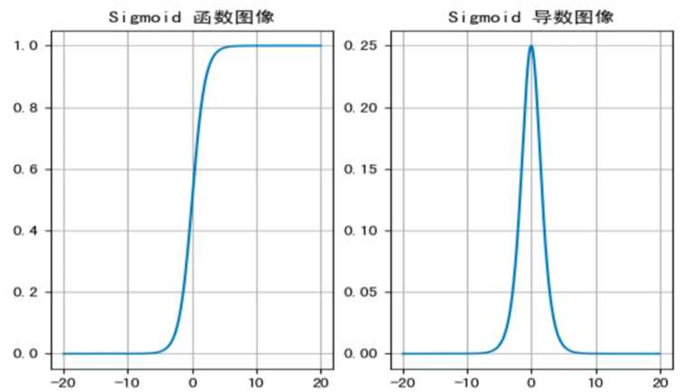
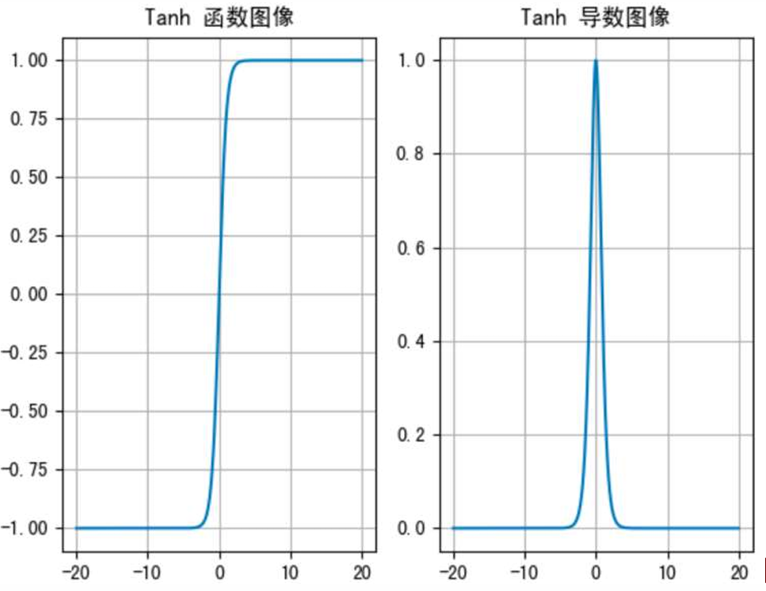
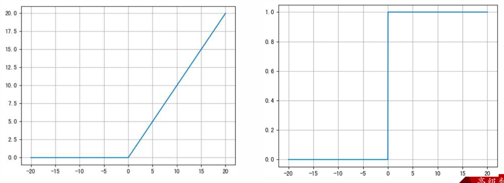
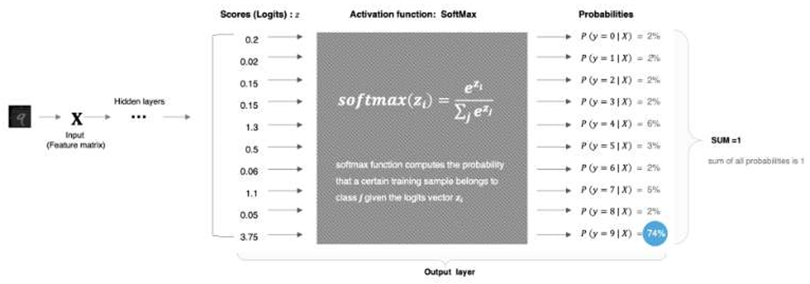

## 激活函数

### [Sigmoid](Sigmoid.py):

激活函数公式：
$$f(x) = \frac{1}{1 + e^{-x}}$$
激活函数求导公式：
$$f'(x) = \left( \frac{1}{1 + e^{-x}} \right)' = \frac{1}{1 + e^{-x}} \left( 1 - \frac{1}{1 + e^{-x}} \right) = f(x)(1 - f(x))$$

sigmoid 激活函数的函数图像如下:

- sigmoid 函数可以将任意的输入映射到 (0, 1) 之间，当输入的值大致在 <-6 或者 >6 时，意味着输入任何值得到的激活值都是差不多的，这样会丢失部分的信息。比如：输入 100 和输出 10000 经过 sigmoid 的激活值几乎都是等于 1 的，但是输入的数据之间相差 100 倍的信息就丢失了。
- 对于 sigmoid 函数而言，输入值在 [-6, 6] 之间输出值才会有明显差异，输入值在 [-3, 3] 之间才会有比较好的效果。
- 通过上述导数图像，我们发现导数数值范围是 (0, 0.25)，当输入 <-6 或者 >6 时，sigmoid 激活函数图像的导数接近为 0，此时网络参数将更新极其缓慢，或者无法更新。
- 一般来说，sigmoid 网络在 5 层之内就会产生梯度消失现象。而且，该激活函数并不是以 0 为中心的，所以在实践中这种激活函数使用的很少。sigmoid 函数一般只用于二分类的输出层。

---

### [Tanh](Tanh.py):
Tanh 的公式如下： 
$$f(x) = \frac{1 - e^{-2x}}{1 + e^{-2x}} = \frac{e^x - e^{-x}}{e^x + e^{-x}}$$

激活函数求导公式： 
$$f'(x) = \left(\frac{1 - e^{-2x}}{1 + e^{-2x}}\right)' = 1 - f^2(x)$$
 Tanh 的函数图像、导数图像如下： 
 

- Tanh 函数将输入映射到 (-1, 1) 之间，图像以 0 为中心，在 0 点对称，当输入大概 <= -3 或者 >= 3 时将被映射为 -1 或者 1。其导数值范围 (0, 1)，当输入的值大概 <= -3 或者 >= 3 时，其导数近似 0。 
- 与 Sigmoid 相比，它是以 0 为中心的，且梯度相对于 sigmoid 大，使得其收敛速度要比 Sigmoid 快，减少迭代次数。然而，从图中可 看出，Tanh 两侧的导数也为 0，同样会造成梯度消失。 
- 若使用时可在隐藏层使用 tanh 函数，在输出层使用 sigmoid 函数。 

---

### [Relu](ReLu.py):
ReLU 公式如下： $$f(x) = \max(0,x)$$ 
激活函数求导公式:  $f'(x) = 0 或  1$ 

ReLU 的函数图像如下：

- ReLU 激活函数将小于 0 的值映射为 0，而大于 0 的值则保持不变，它更加重视正信号，而忽略负信号，这种激活函数运算更为简单，能够提高模型的训练效率。
- 当 $x<0$ 时，ReLU导数为0，而当 $x>0$ 时，则不存在饱和问题。所以，ReLU 能够在 $x>0$ 时保持梯度不衰减，从而缓解梯度消失问题。然而，随着训练的推进，部分输入会落入小于0区域，导致对应权重无法更新。这种现象被称为“神经元死亡”。
- ReLU是目前最常用的激活函数。与sigmoid相比，RELU的优势是：
采用sigmoid函数，计算量大（指数运算），反向传播求误差梯度时，计算量相对大，而采用Relu激活函数，整个过程的计算量节省很多。sigmoid函数反向传播时，很容易就会出现梯度消失的情况，从而无法完成深层网络的训练。Relu会使一部分神经元的输出为0，这样就造成了网络的稀疏性，并且减少了参数的相互依存关系，缓解了过拟合问题的发生。

---
### [Softmax](Softmax.py)
1.3.4. softmax
- 多分类输出层
- 将输出层的加权和（scores/logits）转换概率值，概率值之和是1
  - 隐藏层的权重没有名称,不叫logits
- 选择概率最大的作为结果
- 多分类的目标值：类别标注的热编码结果

softmax用于多分类过程中，它是二分类函数sigmoid在多分类上的推广，目的是将多分类的结果以概率的形式展现出来。计算方法如下图所示：
$$\text{softmax}(z_i) = \frac{e^{z_i}}{\sum_j e^{z_j}} $$
